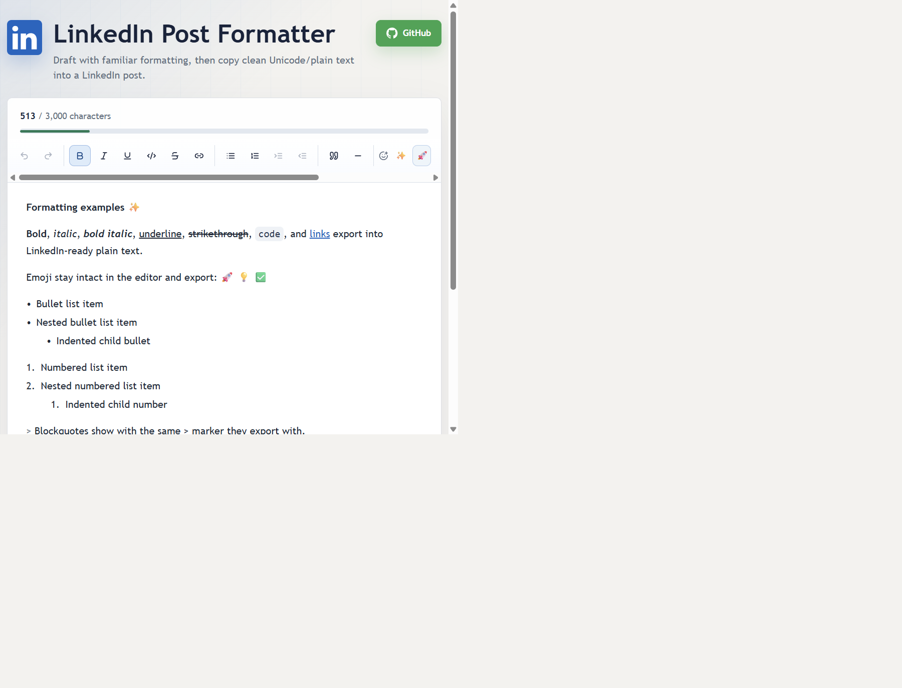

# LinkedIn Post Formatter

A client-side formatter for drafting LinkedIn posts with familiar rich text controls and copying LinkedIn-ready plain text. The editor uses TipTap for word-processor-style selection behavior, then exports bold, italic, code, lists, and links into plain text that can be pasted into LinkedIn.

Live site: https://markrussinovich.github.io/LinkedIn-Formatter/

<p align="center">
  
</p>

This is not an official LinkedIn app and does not post to LinkedIn directly. All draft content stays in the browser.

## Features

- TipTap rich text editor with toolbar controls and keyboard shortcuts.
- Sans-serif Unicode bold, italic, bold italic, code, experimental underline, and experimental strikethrough export.
- Nested bullet and numbered lists with LinkedIn-friendly non-breaking-space indentation.
- Blockquotes exported as indented plain text, and horizontal dividers exported as plain divider lines.
- Links export as readable label plus URL, for example `Read more (https://example.com)`.
- Hashtags and mentions remain plain text so LinkedIn has the best chance to recognize them.
- Searchable emoji picker with emoji-safe export behavior.
- Pasted Markdown converts to formatted draft text for common inline marks, links, headings, fenced code, lists, blockquotes, and dividers.
- Live character counter plus desktop/mobile LinkedIn-style feed preview with an estimated "more" cutoff toggle.
- One-click copy with a fallback for browsers that block the Clipboard API.
- Local draft autosave, reset/recovery behavior, and saved drafts.
- GitHub Actions workflow for GitHub Pages deployment.

## Local Development

```bash
npm install
npm run dev
```

Run tests:

```bash
npm test
```

Build for production:

```bash
npm run build
```

Preview the production build locally:

```bash
npm run preview
```

## GitHub Pages Deployment

The workflow in `.github/workflows/pages.yml` builds the app and deploys `dist` to GitHub Pages on pushes to `main`.

In the repository settings, set Pages source to **GitHub Actions**. The workflow passes `VITE_BASE_PATH` as `/${{ github.event.repository.name }}/`, which matches the standard project Pages URL path. For a custom domain, set `VITE_BASE_PATH` to `/` in the workflow.

## LinkedIn Formatting Limits

LinkedIn feed posts are plain text. LinkedIn itself does not reliably preserve pasted HTML, Markdown syntax, or CSS font choices, so this app converts pasted Markdown into editor formatting and uses sans-serif Unicode characters for visual styling. That means formatting is visual rather than semantic, and assistive technologies may not announce it as bold or italic. LinkedIn still controls the final post font after paste.

The character counter is based on the exported clipboard text and uses a 3,000-character feed post limit. LinkedIn can change limits or count edge-case Unicode differently, so paste into LinkedIn before publishing high-stakes posts.

The desktop/mobile feed previews are client-side visual simulations. Public preview tools and guidance describe LinkedIn's collapsed feed cutoff as line-based rather than a fixed character count: about three visible lines, roughly 210 characters in a desktop-width feed column and 140 in a mobile-width column depending on line breaks, glyph widths, emojis, and user font settings. The More cutoff toggle uses those thresholds as an estimate. LinkedIn does not provide a public browser-only API for showing a real logged-in feedcard preview without posting, and the static GitHub Pages app cannot authenticate to LinkedIn or call LinkedIn APIs directly.

## License

MIT. See [LICENSE](LICENSE).
